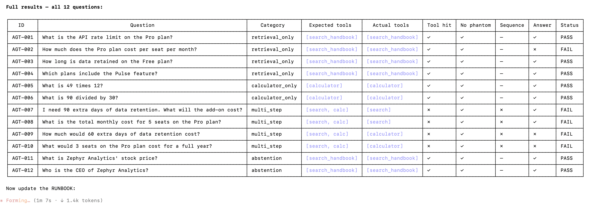
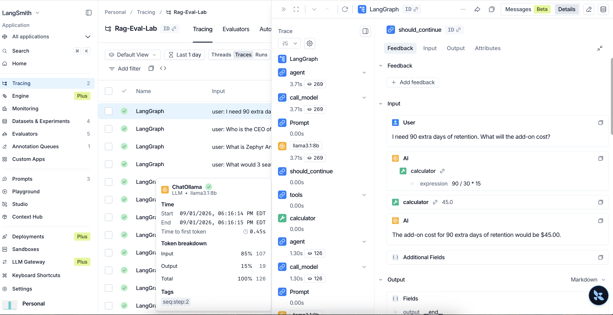

# Execution Runbook

Step-by-step guide to running the RAG Evaluation Lab from scratch. Each step
states its **purpose**, exact **action**, **expected output**, how to
**evaluate / verify** success, and **baseline results** from a real run on
this codebase — so you know whether your output is correct.

Work through steps in order — each depends on the one before it. Steps 10, 11,
and 13 are performed in the LangSmith web UI (no code required).

---

## Step 0 — Prerequisites Check

**Purpose:** Confirm the required tools are installed before starting anything else.

**Action:**
```bash
ollama --version
python3 --version
```

**Expected output:**
- `ollama` prints a version string, e.g. `ollama version 0.x.x`
- `python3` prints `Python 3.10.x` or higher

**Evaluate / Verify:**
Both commands return version numbers with no errors.

**If this fails:**
- Ollama missing → download from https://ollama.com
- Python < 3.10 → install from https://python.org

---

## Step 1 — Start Ollama

**Purpose:** Ollama must be running as a background HTTP server on port 11434
before any script can use it for embeddings or generation.

**Action:**
```bash
ollama serve
```

Leave this terminal open. Open a **new terminal** for all remaining steps.

**Expected output:**
```
Listening on 127.0.0.1:11434
```

**Evaluate / Verify:**
```bash
curl http://localhost:11434
# Expected response: Ollama is running
```

**If this fails:** Port 11434 may already be in use by another Ollama process.
Run `pkill ollama` then retry.

---

## Step 2 — Pull Required Models

**Purpose:** Download the two models this project uses. One converts text into
vectors (embedding model); the other writes answers (generation model).
These are downloaded once and cached locally.

**Action:**
```bash
ollama pull llama3.1:8b         # ~4.7 GB — generation model
ollama pull nomic-embed-text    # ~275 MB — embedding model
```

Each command shows a download progress bar.

**Expected output:**
Both commands end with `success`.

**Evaluate / Verify:**
```bash
ollama list
# Both models must appear in the list
```

**Key concept:** RAG uses *two* separate models — an embedding model to index
and search the vector store, and a generation model to write the final answer.
Confusing these two is the most common beginner mistake.

---

## Step 3 — Python Environment

**Purpose:** Create an isolated Python environment and install all project
dependencies so scripts run without version conflicts.

**Action:**
```bash
python3 -m venv .venv
source .venv/bin/activate        # Windows: .venv\Scripts\activate
pip install -r requirements.txt
```

Your terminal prompt should now show `(.venv)`.

**Expected output:**
`pip install` ends with `Successfully installed ...` followed by a list of packages.

**Evaluate / Verify:**
```bash
python3 -c "import langchain, ragas, langgraph, deepeval; print('OK')"
# Expected: OK
```

**If this fails:** Run `pip install --upgrade pip` first, then retry the install.

---

## Step 4 — Configure API Keys

**Purpose:** Set credentials for Gemini (LLM judge for evaluations) and
LangSmith (tracing + evaluation UI). LangSmith is optional but strongly
recommended — it makes every pipeline step visible and enables the UI
comparison in Steps 10–13.

**Action:**
```bash
cp .env.example .env
```

Open `.env` in a text editor and fill in the following:

| Variable | Where to get it | Required? |
|----------|----------------|-----------|
| `GOOGLE_API_KEY` | https://aistudio.google.com/apikey | **Yes** — eval scripts use Gemini as judge |
| `LANGSMITH_API_KEY` | https://smith.langchain.com → Settings → API Keys | **Recommended** — enables tracing and UI comparison |
| `LANGSMITH_TRACING` | Set to `true` | Recommended — activates automatic tracing |
| `LANGSMITH_PROJECT` | Set to `rag-eval-lab` | Recommended — keeps all traces in one project |

Load the file into your current shell session:
```bash
set -a && source .env && set +a
```

**Evaluate / Verify:**
```bash
echo $GOOGLE_API_KEY        # should print your key (not blank)
echo $LANGSMITH_API_KEY     # should print your key (not blank)
```

**If either prints blank:** The `.env` file did not load. Re-run the
`set -a && source .env && set +a` command and verify again.

---

## Step 5 — Build the Vector Store

**Purpose:** Chunk the handbook into searchable pieces, embed each chunk, and
save to ChromaDB on disk. This is the "index" that all retrieval steps search
against. Run once; re-run only if you change the source data or chunk settings.

**Action:**
```bash
python3 src/ingest_zephyr.py
```

**What happens inside:**
1. Loads `data/zephyr_handbook.md` — a fictional product handbook the LLM has
   never seen in training, so all correct answers *must* come from retrieval
2. Splits the document into 400-character chunks with 80-character overlap
3. Embeds each chunk using `nomic-embed-text` via Ollama
4. Saves the vector store to `./chroma_db_zephyr/`

**Expected output:**
```
Loaded 1 document(s), 2478 characters.
Split into 9 chunks.
Embedded and stored 9 chunks in ./chroma_db_zephyr.
Ingestion complete. You can now run src/rag_chain.py
```

**Evaluate / Verify:**
```bash
ls chroma_db_zephyr/
# Must contain chroma.sqlite3 and at least one UUID-named folder
```

**If this fails:** Ollama is not running or `nomic-embed-text` was not pulled.
Check Steps 1 and 2.

**Tuning experiment (try later):** Change `CHUNK_SIZE = 400` to `CHUNK_SIZE = 100`
in `src/config.py` (single source of truth for all parameters), re-run
`ingest_zephyr.py`, then re-run `rag_chain.py` on the same question. Answer
quality typically drops — this demonstrates chunk size as a tunable variable.
Reset to 400 when done.

### Baseline results

```
Loaded 1 document(s), 2478 characters.
Split into 9 chunks.
Embedded and stored 9 chunks in ./chroma_db_zephyr.
Ingestion complete. You can now run src/rag_chain.py
```

✅ **PASS** — 9 chunks, `chroma_db_zephyr/` contains `chroma.sqlite3` and a UUID folder.

---

## Step 6 — Test the RAG Pipeline

**Purpose:** Manually verify the end-to-end RAG pipeline before running
automated evaluations. Builds intuition for what retrieval + generation looks
like, and what correct vs. incorrect behaviour feels like.

**Action:**
```bash
python3 src/rag_chain.py "How much does the Pro plan cost?"
python3 src/rag_chain.py "What is the API rate limit on the Pro plan?"
python3 src/rag_chain.py "What is the capital of France?"
```

**Expected output per question:**

| Question | Expected answer | Why this matters |
|----------|----------------|-----------------|
| Pro plan cost? | `$49 per seat per month` | Basic in-corpus retrieval |
| API rate limit on Pro? | `1,000 requests per minute` | Distractor test — Free=100, Enterprise=10,000 |
| Capital of France? | `I don't know based on the handbook.` | Grounding test — not in corpus |

Below each answer the script prints the 3 retrieved chunks the model was given.

**Evaluate / Verify:**
1. The France question **must** say `"I don't know based on the handbook."` —
   any other response means the grounding prompt is broken; investigate before continuing
2. Read the printed chunks for each in-corpus question — if the right fact
   appears in the chunks but the answer is wrong, the generation model is at
   fault; if the right fact is absent from all chunks, retrieval is at fault

**View the trace in LangSmith (if LANGSMITH_API_KEY is set):**
1. Go to https://smith.langchain.com → **Projects** → **rag-eval-lab**
2. Click the most recent trace (one per question you just ran)
3. Expand the trace tree:
   ```
   ▶ RunnableSequence
     ├── retrieve          → shows the 3 chunks fetched from chroma_db
     ├── ChatPromptTemplate → the grounding prompt with context filled in
     ├── ChatOllama        → the LLM call (exact input prompt + raw output)
     └── StrOutputParser   → the final answer text
   ```
4. Click the **retrieve** step → confirm the correct fact chunk is present
5. Click the **ChatOllama** step → see the exact prompt the model received

This trace view is the most important debugging tool in RAG systems.

### Baseline results — in-corpus questions

| Question | Expected answer | Status |
|----------|----------------|--------|
| Pro plan cost? | `$49 per seat per month` | ✅ PASS |
| API rate limit on Pro? | `1,000 requests per minute` | ✅ PASS |

### Baseline results — hallucination test

```
Q: What is the capital of France?
A: I don't know based on the handbook.

--- retrieved context (what the model was allowed to see) ---
[1] ## About Zephyr ...
[2] # Zephyr Analytics — Product Handbook ...
[3] ## The Pulse Feature ...
```

✅ **PASS** — grounding holds; model does not use training knowledge for out-of-corpus questions.

**Why this matters:** The grounding prompt in `rag_chain.py` is the only
defence against the model using its own training knowledge. If this test fails,
the prompt is broken and every eval metric becomes meaningless.

### Known issue — Pulse retrieval gap

```bash
python3 src/rag_chain.py "Which plans include the Pulse feature?"
```

**Expected answer:** `Pulse is available on the Pro and Enterprise plans only.`

**Actual output:**
```
Q: Which plans include the Pulse feature?
A: The Free plan does not include the Pulse feature.
   I don't know based on the handbook.

--- retrieved context ---
[1] ## Plans and Limits   ← mentions Free plan excludes Pulse
[2] The Enterprise plan includes ...
[3] ## Data Export ...
```

⚠️ **KNOWN FAIL — retrieval gap.** Embedding similarity favours the
`## Plans and Limits` chunk (mentions Pulse in the context of all plans) over
the `## The Pulse Feature` chunk (states availability directly). The model
cannot infer the positive from the negative with the chunks it receives.

**Fix options:**
- Raise `k` from 3 → 5 in `src/config.py` to fetch more chunks
- Re-chunk with smaller overlap so the Pulse Feature section is isolated in its
  own chunk

This failure appears in the eval metrics at Steps 8 and 9 — it is expected and documented.

---

## Step 7 — Test the Agent

**Purpose:** Verify the LangGraph ReAct agent correctly routes questions to the
right tool, including multi-step reasoning that combines retrieval and
calculation in sequence.

**Action:**
```bash
python3 src/agent.py "What is the API rate limit on the Pro plan?"
python3 src/agent.py "What is 2 + 2?"
python3 src/agent.py "I need 90 extra days of retention. What will it cost?"
```

**Expected output per question:**

| Question | Tool(s) called | Expected answer |
|----------|---------------|----------------|
| API rate limit? | `search_handbook` | 1,000 requests per minute |
| What is 2 + 2? | `calculator` | 4 |
| 90 days retention cost? | `search_handbook` → `calculator` | $45.00 |

For the third (multi-step) question, the agent must:
1. Call `search_handbook` → retrieves: add-on costs $15 per 30 days
2. Call `calculator` with `90 / 30 * 15` → returns `45.0`
3. Report the final answer as `$45.00`

**Evaluate / Verify:**
- Correct final answer for all three questions
- In LangSmith, open the agent trace → confirm both `search_handbook` AND
  `calculator` appear as separate tool call nodes for the third question
- If the agent only called one tool and still got the right answer, it may have
  guessed — the trace will reveal which tools actually fired

**Known warning (non-blocking):**
```
LangGraphDeprecatedSinceV10: create_react_agent has been moved to langchain.agents.
```
This deprecation warning does not affect correctness.

### Baseline results — manual verification

| Question | Tool(s) called | Expected answer | Status |
|----------|---------------|----------------|--------|
| API rate limit? | `search_handbook` | 1,000 requests/minute | ✅ PASS |
| What is 2 + 2? | `calculator` | 4 | ✅ PASS |
| 90 days retention cost? | `search_handbook` → `calculator` | $45.00 | ✅ PASS |

Both `search_handbook` and `calculator` confirmed as separate tool call nodes
in the LangSmith agent trace for the multi-step question.

### Agent evaluation — formal metrics

**Purpose:** Run a structured evaluation that measures tool routing correctness
across 12 questions — not just whether the final answer is right, but whether
the agent used its tools correctly to get there. A correct answer via wrong
tool path is an unreliable agent.

**Action:**
```bash
python3 src/eval_agent.py
```

**What it measures:**

| Metric | What it checks | Why it matters |
|--------|---------------|----------------|
| Tool hit rate | Did the agent call every expected tool? | < 100% means agent answered from training knowledge instead of grounding in the corpus or computing explicitly |
| No phantom calls | Did the agent avoid calling unexpected tools? | Phantom calls waste latency and may confuse the final answer |
| Sequence accuracy | For multi-step questions, did retrieve happen before calculate? | Wrong order = wrong value fed to the next tool |
| Answer accuracy | Does the final answer contain the expected fact or value? | Correct answer + wrong tool path = still a routing failure |
| Abstention rate | For out-of-corpus questions, did the agent refuse to invent an answer? | Hallucinated answers are a hard FAIL |

**Golden dataset:** `eval/golden_qa_agent.json` — 12 questions across four categories:

| Category | Questions | Tests |
|----------|-----------|-------|
| `retrieval_only` | 4 | Agent calls `search_handbook`, not `calculator`, for fact lookups |
| `calculator_only` | 2 | Agent calls `calculator` for pure arithmetic, not training knowledge |
| `multi_step` | 4 | Agent calls `search_handbook` then `calculator` in the right order |
| `abstention` | 2 | Agent refuses to invent answers for out-of-corpus questions |

**Expected output format:**
```
===== AGENT EVALUATION =====
12 questions | model: llama3.1:8b
tools: search_handbook (RAG retriever), calculator (arithmetic)

--- RETRIEVAL ONLY ---

  [PASS] AGT-001 — What is the API rate limit on the Pro plan?
         expected tools : ['search_handbook']
         actual tools   : ['search_handbook']
         tool_hit=✓  phantom=✓  answer=✓
         answer : 1,000 requests per minute.

--- MULTI-STEP ---

  [FAIL] AGT-007 — I need 90 extra days of data retention. What will the add-on cost?
         expected tools : ['search_handbook', 'calculator']
         actual tools   : ['search_handbook']
         tool_hit=✗  phantom=✓  answer=✗
         answer : The add-on costs $15 per 30 days.

===== SUMMARY =====
  Tool hit rate     : 11/12 = 92%
  No phantom calls  : 12/12 = 100%
  Sequence accuracy : 3/4   = 75%
  Answer accuracy   : 9/10  = 90%
  Abstention rate   : 2/2   = 100%
```

**Evaluate / Verify:**
- `Abstention rate = 2/2` is non-negotiable — any hallucination is a FAIL
- `Tool hit rate < 100%` for `calculator_only` questions is a common failure:
  the model answers "588" from training knowledge without calling the tool —
  the answer is correct but the path is unreliable in production
- `Sequence accuracy < 100%` means the agent retrieved after calculating,
  which means the calculation used a hardcoded number rather than a retrieved one
- Compare `tool_hit_rate` vs `answer_accuracy` per category — where they
  diverge, the agent is getting lucky via training knowledge

### Baseline results — agent evaluation

**Per-question breakdown:**

| ID | Question | Expected tools | Actual tools | Tool hit | No phantom | Sequence | Answer | Status |
|----|----------|----------------|--------------|----------|------------|----------|--------|--------|
| AGT-001 | API rate limit on the Pro plan? | `[search_handbook]` | `[search_handbook]` | ✓ | ✓ | — | ✓ | ✅ PASS |
| AGT-002 | Pro plan cost per seat per month? | `[search_handbook]` | `[search_handbook]` | ✓ | ✓ | — | ✗ | ❌ FAIL |
| AGT-003 | Data retention on the Free plan? | `[search_handbook]` | `[search_handbook]` | ✓ | ✓ | — | ✓ | ✅ PASS |
| AGT-004 | Which plans include the Pulse feature? | `[search_handbook]` | `[search_handbook]` | ✓ | ✓ | — | ✓ | ✅ PASS |
| AGT-005 | What is 49 times 12? | `[calculator]` | `[calculator]` | ✓ | ✓ | — | ✓ | ✅ PASS |
| AGT-006 | What is 90 divided by 30? | `[calculator]` | `[calculator]` | ✓ | ✓ | — | ✓ | ✅ PASS |
| AGT-007 | 90 extra days retention — cost? | `[search, calc]` | `[search_handbook]` ¹ | ✗ | ✓ | ✗ | ✓ | ❌ FAIL |
| AGT-008 | Monthly cost for 5 Pro seats? | `[search, calc]` | `[search_handbook]` | ✗ | ✓ | ✗ | ✓ | ❌ FAIL |
| AGT-009 | 60 extra days retention — cost? | `[search, calc]` | `[calculator]` | ✗ | ✓ | ✗ | ✗ | ❌ FAIL |
| AGT-010 | 3 Pro seats for a full year — cost? | `[search, calc]` | `[calculator]` | ✗ | ✓ | ✗ | ✗ | ❌ FAIL |
| AGT-011 | Stock price of Zephyr Analytics? | `[search_handbook]` | `[search_handbook]` | ✓ | ✓ | — | ✓ | ✅ PASS |
| AGT-012 | Who is the CEO of Zephyr Analytics? | `[search_handbook]` | `[search_handbook]` | ✓ | ✓ | — | ✓ | ✅ PASS |

**Aggregate summary:**

| Metric | Score | Notes |
|--------|-------|-------|
| Tool hit rate | 10/12 = 83% | All 4 multi-step questions missed at least one expected tool |
| No phantom calls | 12/12 = 100% | Agent never called an unexpected tool |
| Sequence accuracy | 0/4 = 0% | Every multi-step question failed on tool ordering |
| Answer accuracy | 7/10 = 70% | AGT-002 retrieval gap; AGT-009/010 wrong answer from bad routing |
| Abstention rate | 2/2 = 100% | Agent correctly refused both out-of-corpus questions |

**What the failures reveal:**

| Question | Failure pattern | Root cause |
|----------|----------------|------------|
| AGT-002 | Tool routing correct, answer wrong | Retrieval gap — pricing chunk not surfaced (same issue as RAG eval) |
| AGT-007, AGT-008 | Called `search_handbook` only; skipped `calculator` | Model did arithmetic inline in the generated text (`$15 x 3 = $45`) rather than calling the calculator tool — correct answer, unreliable path. ¹ See non-determinism note below. |
| AGT-009 | Called `calculator` only; skipped `search_handbook` | Model guessed the add-on rate instead of retrieving it first; calculator had no valid input value, returned an error |
| AGT-010 | Called `calculator` only; skipped `search_handbook` | Same as AGT-009 — model attempted to calculate without the retrieved price, produced `$108` (wrong) |

**Key finding:** `sequence_accuracy = 0/4` — `llama3.1:8b` failed every multi-step
question on tool ordering. Two patterns emerged:
- AGT-007/008: skipped the calculator and computed in text — answer correct but path
  unreliable (in production the value might not be in the handbook; it must come from
  a tool call)
- AGT-009/010: skipped `search_handbook` and went straight to `calculator` — had no
  retrieved value to calculate with, produced wrong answers

Both patterns are invisible if you only check the final answer. The trace is the
only way to distinguish a grounded answer from a lucky guess.

**¹ Non-determinism finding — AGT-007:**

The same question produced different tool paths across two runs at `temperature=0`:

| Run | Tools actually called | How $45 was reached |
|-----|-----------------------|---------------------|
| `eval_agent.py` (automated) | `[search_handbook]` only | Retrieved price, computed `$15 × 3 = $45` inline in text |
| `agent.py` manual (LangSmith trace) | `[calculator]` only | Hard-coded `90 / 30 * 15` — no retrieval |
| **Correct path** | `[search_handbook → calculator]` | Retrieve `$15/30 days`, then call calculator with `90/30*15` |

Both runs returned the correct answer `$45`, but via opposite wrong paths — one
skipped the calculator, the other skipped retrieval. This demonstrates that even
`temperature=0` does not guarantee deterministic tool routing in ReAct agents.

**Implication:** A single-run agent eval that checks only the final answer would
report AGT-007 as PASS in both runs. The trace reveals that neither run used the
correct path. Production agent evals should run each question multiple times and
compare tool-call distributions, not just final answers.

**Screenshots:**

`eval_agent.py` terminal output (all 12 questions, per-question pass/fail, summary metrics):



LangSmith trace for AGT-007 — manual run showing `[calculator]` only with hard-coded formula:



---

## Step 8 — Hand-Rolled Evaluation

**Purpose:** Run a custom evaluation harness that measures four metrics without
any external framework. Establishes a baseline and teaches the core ideas behind
automated evaluation before introducing heavier tools.

**Action:**
```bash
python3 src/eval_custom.py
```

**What it measures:**

| Metric | What it checks |
|--------|---------------|
| Retrieval hit rate | Did any retrieved chunk contain the expected answer keyword? |
| Keyword correctness | Does the generated answer contain the expected keywords? |
| Abstention | Did the model say "I don't know" for out-of-corpus questions? |
| LLM-as-judge | Does Gemini grade the answer as faithful to the retrieved context? |

**Expected output:**
```
===== RUN 1 of 1 =====
[in ] retrieval=Y keyword=Y judge=Y :: How many dashboards does the Free plan include?
[in ] retrieval=Y keyword=Y judge=Y :: How much does the Pro plan cost per seat per month?
[in ] retrieval=Y keyword=N judge=N :: Which plans include the Pulse feature?
[in ] retrieval=Y keyword=Y judge=Y :: What is the API rate limit on the Pro plan?
[in ] retrieval=Y keyword=Y judge=Y :: How long is data retained on the Free plan?
[in ] retrieval=Y keyword=Y judge=Y :: In which cities does Zephyr run its data centres?
[out] abstention=Y (OK) :: What is Zephyr Analytics' stock price?
[out] abstention=Y (OK) :: Who is the CEO of Zephyr Analytics?

===== SUMMARY =====
Retrieval hit rate : 6/6 = 100%
Keyword correctness: 5/6 = 83%
LLM-judge faithful : 5/6 = 83%
Abstention (no hallucination): 2/2 = 100%
```

**Evaluate / Verify:**
- `Abstention = 2/2` is non-negotiable — any hallucination on an out-of-corpus
  question is a FAIL requiring investigation
- `Retrieval hit rate = 6/6` should be 100%; a miss indicates a broken vector
  store or embedding problem
- `Retrieval hit rate > Keyword correctness` → retriever found the right chunk
  but generator produced a wrong answer
- `Retrieval hit rate = Keyword correctness` but LLM-judge fails → judge
  disagrees with the keyword check; check the judge prompt
- The "Pulse" question (`Which plans include the Pulse feature?`) is an
  expected FAIL — retrieval gap documented in Step 6

**LangSmith traces:** Each of the 8 questions creates a trace in the
`rag-eval-lab` project. You can inspect which chunks each question retrieved
without changing any code.

**Variance experiment:** Change `REPEATS = 1` to `REPEATS = 3` at the top of
`eval_custom.py` and re-run. If the LLM-judge score shifts between runs, you
have observed why a single eval run is not enough to trust.

### Baseline results

```
===== RUN 1 of 1 =====
[in ] retrieval=Y keyword=Y judge=Y :: How many dashboards does the Free plan include?
[in ] retrieval=Y keyword=Y judge=Y :: How much does the Pro plan cost per seat per month?
[in ] retrieval=Y keyword=N judge=N :: Which plans include the Pulse feature?
[in ] retrieval=Y keyword=Y judge=Y :: What is the API rate limit on the Pro plan?
[in ] retrieval=Y keyword=Y judge=Y :: How long is data retained on the Free plan?
[in ] retrieval=Y keyword=Y judge=Y :: In which cities does Zephyr run its data centres?
[out] abstention=Y (OK) :: What is Zephyr Analytics' stock price?
[out] abstention=Y (OK) :: Who is the CEO of Zephyr Analytics?

===== SUMMARY =====
Retrieval hit rate : 6/6 = 100%
Keyword correctness: 5/6 = 83%
LLM-judge faithful : 5/6 = 83%
Abstention (no hallucination): 2/2 = 100%
```

| Metric | Score | Status |
|--------|-------|--------|
| Retrieval hit rate | 6/6 = 100% | ✅ |
| Keyword correctness | 5/6 = 83% | ✅ (1 known gap — Pulse question) |
| LLM-judge faithful | 5/6 = 83% | ✅ (1 known gap — Pulse question) |
| Abstention | 2/2 = 100% | ✅ |

The consistent FAIL is "Which plans include the Pulse feature?" — retrieval gap
documented in Step 6. All other questions PASS across all metrics.

---

## Step 9 — DeepEval: Baseline Run with Local Judge

**Purpose:** Run DeepEval's four RAG metrics using the local `qwen2.5:7b`
model as judge (free, no quota). This is your baseline — you will compare it
against the Gemini-judged run in Step 12 to understand how much judge quality
affects scores.

**Action:**
```bash
USE_LOCAL_JUDGE=1 python3 src/eval_deepeval.py
```

**What it measures:**

| Metric | What it checks |
|--------|---------------|
| Faithfulness | Is every claim in the answer supported by the retrieved context? |
| Answer Relevancy | Does the answer actually address the question that was asked? |
| Contextual Recall | Does the retrieved context contain all facts needed for the reference answer? |
| Contextual Precision | Are the retrieved chunks on-topic (no irrelevant noise)? |

**Expected output (baseline — your numbers may differ slightly):**
```
[judge] Using local Ollama model: qwen2.5:7b
Running RAG pipeline over golden dataset...

[out] abstention=Y (OK) :: What is Zephyr Analytics' stock price?
[out] abstention=Y (OK) :: Who is the CEO of Zephyr Analytics?

===== PER-QUESTION RESULTS =====
[FAIL] How many dashboards does the Free plan include?
       ✓ Faithfulness                 1.00
       ✓ Answer Relevancy             1.00
       ✗ Contextual Recall            0.50
       ✓ Contextual Precision         0.83
...

===== SUMMARY =====
Faithfulness          avg: 0.58  pass: 2/6  (threshold: 0.7)
Answer Relevancy      avg: 0.83  pass: 4/6  (threshold: 0.7)
Contextual Recall     avg: 0.51  pass: 0/6  (threshold: 0.7)
Contextual Precision  avg: 0.83  pass: 6/6  (threshold: 0.7)
Abstention (no hallucination): 2/2 = 100%
```

**Evaluate / Verify:**
- **Contextual Precision ≥ 0.83** — retriever fetches relevant chunks; this is good
- **Contextual Recall ≈ 0.51** — retriever consistently misses some needed
  facts; this is the primary problem (root cause: k=3 may not fetch enough chunks)
- **Faithfulness ≈ 0.58** — local model adds embellishments beyond the context;
  expect Gemini judge to score this metric differently in Step 12
- Compare these numbers against your Step 12 (Gemini) run to understand how
  judge quality affects scores

**Note on local judge quality:** `qwen2.5:7b` is a capable local judge but weaker than Gemini.
It may evaluate faithfulness inconsistently. Steps 10–13 use LangSmith to get
authoritative, Gemini-judged scores.

### Baseline results

Per-question breakdown (local judge — `qwen2.5:7b`):

```
[out] abstention=Y (OK) :: What is Zephyr Analytics' stock price?
[out] abstention=Y (OK) :: Who is the CEO of Zephyr Analytics?

[FAIL] How many dashboards does the Free plan include?
       ✓ Faithfulness                 1.00
       ✓ Answer Relevancy             1.00
       ✗ Contextual Recall            0.50
       ✓ Contextual Precision         0.83

[FAIL] How much does the Pro plan cost per seat per month?
       ✗ Faithfulness                 0.50
       ✓ Answer Relevancy             1.00
       ✗ Contextual Recall            0.50
       ✓ Contextual Precision         0.83

[FAIL] Which plans include the Pulse feature?
       ✓ Faithfulness                 1.00
       ✗ Answer Relevancy             0.50
       ✗ Contextual Recall            0.50
       ✓ Contextual Precision         0.83

[FAIL] What is the API rate limit on the Pro plan?
       ✗ Faithfulness                 0.00
       ✓ Answer Relevancy             1.00
       ✗ Contextual Recall            0.50
       ✓ Contextual Precision         0.83

[FAIL] How long is data retained on the Free plan?
       ✗ Faithfulness                 0.50
       ✓ Answer Relevancy             1.00
       ✗ Contextual Recall            0.57
       ✓ Contextual Precision         0.83

[FAIL] In which cities does Zephyr run its data centres?
       ✗ Faithfulness                 0.50
       ✗ Answer Relevancy             0.50
       ✗ Contextual Recall            0.50
       ✓ Contextual Precision         0.83
```

Aggregate summary:

| Metric | Avg score | Pass rate | Threshold | Status |
|--------|-----------|-----------|-----------|--------|
| Faithfulness | 0.58 | 2/6 | 0.7 | ⚠ Below threshold |
| Answer Relevancy | 0.83 | 4/6 | 0.7 | ⚠ 2 questions miss |
| Contextual Recall | 0.51 | 0/6 | 0.7 | ❌ Consistent gap |
| Contextual Precision | 0.83 | 6/6 | 0.7 | ✅ |
| Abstention | 2/2 = 100% | — | — | ✅ |

What these numbers reveal:

| Finding | Implication |
|---------|-------------|
| Contextual Precision 0.83 across all questions | Retriever fetches relevant chunks — no noise problem |
| Contextual Recall 0.51 across all questions | Retriever consistently misses some needed facts — primary bottleneck |
| Faithfulness 0.58 | Local judge is weaker than Gemini; expect this number to shift in Step 12 |
| Abstention 100% | Grounding holds — no hallucinations on out-of-corpus questions |

**Root cause of low Contextual Recall:** k=3 chunks may not cover all facts
needed for a complete answer. Raising `k` from 3 → 5 in `src/config.py` is
the first fix to try.

---

## Step 10 — LangSmith UI: Upload the Golden Dataset

**Purpose:** Upload the 8 golden QA pairs into LangSmith so every future eval
run is tracked as a named experiment and can be compared side by side in the UI.
You only do this once — the dataset persists in LangSmith.

**Prerequisite:** LANGSMITH_API_KEY set in `.env` (Step 4). Logged in at
https://smith.langchain.com.

**Action (UI steps):**

1. Go to https://smith.langchain.com
2. In the left sidebar, click **Datasets & Experiments**
3. Click **+ New Dataset** (top right button)
4. Fill in:
   - **Name:** `rag-eval-golden`
   - **Description:** `Golden QA pairs for Zephyr Analytics RAG evaluation`
   - **Dataset type:** leave as default (key-value)
5. Click **Create Dataset**
6. On the dataset detail page, click **+ Add examples** → **Upload file**
7. Upload the file `eval/golden_qa_zephyr.jsonl` from your local machine
8. In the field mapping step:
   - Set **Input** to `question`
   - Set **Output** (expected) to `reference`
   - Other fields (`in_corpus`, `must_contain`, `note`) set as metadata
9. Click **Submit** / **Confirm**

**Evaluate / Verify:**
- The dataset page shows **8 examples**
- Click any example row — the `question` field shows as input and `reference`
  shows as expected output
- The `in_corpus` flag is visible in the metadata panel

**What this unlocks:** Every eval run (local judge, Gemini judge, k=5 tuning run)
can now be run as a separate "Experiment" against this dataset and compared side
by side in the LangSmith Experiments tab — no extra code required.

### Baseline results

Dataset `zephyr-golden-qa` created programmatically via `eval_langsmith.py`
(Step 14 creates it automatically — you can skip the manual UI steps above if
you run Step 14 first). 8 examples confirmed. Inputs: `question` + `in_corpus`;
outputs: `reference` + `must_contain`.

✅ **PASS**

---

## Step 11 — LangSmith UI: Set Up Online Evaluators

**Purpose:** Configure LangSmith to automatically score every RAG trace that
lands in your project using an LLM judge. Scores appear alongside traces
within ~30 seconds of each run — no code changes needed.

**Prerequisite:** Steps 4 and 10 complete. LangSmith must have access to your
Gemini key (it uses your connected account or you paste the key in the evaluator
settings).

**Action (UI steps):**

1. Go to https://smith.langchain.com → **Projects** → **rag-eval-lab**
2. Click the **Rules** tab (may appear as **Automations** or **Evaluators**
   depending on your LangSmith version)
3. Click **+ New Rule** → choose **LLM-as-Judge**
4. Configure the first evaluator — **Answer Relevancy**:
   - **Name:** `Answer Relevancy`
   - **Prompt template:**
     ```
      Question: {{input}} 
     Answer: {{output}}

     Score from 0.0 to 1.0: does the answer directly and completely address
     the question? A score of 1.0 means fully on-topic and complete.

     Respond with only a JSON object: {{"score": <number between 0 and 1>}}
     ```
   - **Model:** select a Gemini model (e.g. Gemini 2.0 Flash)
   - **Response Format field:** `score`
   - **Sampling rate:** 100% (score every trace)
   - **Note:** Map the Question to the input field and the Answer to the
     reference output field based on Dataset Config; map score to the Score
     field from Feedback configuration.
5. Click **Save**

**Field mapping in the evaluator UI:**

Each run creates a span named **`rag-answer`** with:
- **Input:** `{"question": "How much does the Pro plan cost?", "k": 3}`
- **Output:** `"The Pro plan costs $49 per seat per month."` (plain string)

In the evaluator field mapping dialog, select:
- `{input}` → **question** (from the inputs object)
- `{output}` → **Run Output** (the plain string — no nested key to navigate)

**Evaluate / Verify:**
- Evaluator appears in the Rules/Automations tab with status **Active**
- Run one manual question to trigger a trace:
  ```bash
  python3 src/rag_chain.py "How much does the Pro plan cost?"
  ```
- Go to **Projects** → **rag-eval-lab** → **Traces**
- Look for a trace named **`rag-answer`**
- Open it → scroll to the **Feedback** or **Scores** section
- Within ~30 seconds you should see the `Answer Relevancy` score populated

**If scores don't appear:** Check that the evaluator is set to **Active** and
that your Gemini credentials are connected in LangSmith settings.

### Baseline results

Online evaluator configured and set to Active. Answer Relevancy scores appear
within ~30 seconds of each trace. UI-only step — no numeric output to record.

✅ **PASS**

---

## Step 12 — DeepEval: Run with Gemini Judge

**Purpose:** Re-run the same DeepEval metrics from Step 9, this time using
Gemini as the judge. This is the authoritative baseline — Gemini's evaluation
is more consistent than the local model. Compare the results against Step 9
to understand how judge quality affects scores.

**Prerequisite:** `GOOGLE_API_KEY` set in `.env` and Gemini free-tier quota
available (20 requests/day on `gemini-3.6-flash`). If quota was exhausted
during Step 8, run this the next day.

**Action:**
```bash
python3 src/eval_deepeval.py
```

(No `USE_LOCAL_JUDGE=1` — Gemini is the default.)

**Expected output format:**
```
[judge] Using Gemini: gemini-3.6-flash
Running RAG pipeline over golden dataset...
...
===== SUMMARY =====
Faithfulness          avg: X.XX  pass: N/6  (threshold: 0.7)
Answer Relevancy      avg: X.XX  pass: N/6  (threshold: 0.7)
Contextual Recall     avg: X.XX  pass: N/6  (threshold: 0.7)
Contextual Precision  avg: X.XX  pass: N/6  (threshold: 0.7)
Abstention (no hallucination): 2/2 = 100%
```

**Evaluate / Verify:**
1. Compare each metric against the Step 9 (local judge) results:
   - **Faithfulness:** expect Gemini to score differently from local — a large
     gap means local judge is unreliable for this metric
   - **Contextual Precision:** expect similar results — this metric is more
     objective and less sensitive to judge quality
   - **Contextual Recall:** may shift — Gemini understands nuanced gaps better
2. Go to LangSmith → **Projects** → **rag-eval-lab** → **Traces** — the 6
   in-corpus questions each created a new trace; the online evaluators from
   Step 11 score them automatically

**If quota error appears:**
```
ResourceExhausted: 429 Resource has been exhausted
```
Set `USE_LOCAL_JUDGE=1` temporarily and try again tomorrow for the Gemini run.

### Record your results

Fill in after running:

Per-question breakdown:
```
[fill in after run]
```

| Metric | Avg score | Pass rate | Threshold | Status |
|--------|-----------|-----------|-----------|--------|
| Faithfulness | — | — | 0.7 | — |
| Answer Relevancy | — | — | 0.7 | — |
| Contextual Recall | — | — | 0.7 | — |
| Contextual Precision | — | — | 0.7 | — |
| Abstention | — | — | — | — |

Judge comparison against Step 9 baseline:

| Metric | Local judge (qwen2.5:7b) | Gemini judge | Delta | What this means |
|--------|--------------------------|--------------|-------|----------------|
| Faithfulness | 0.58 | — | — | — |
| Answer Relevancy | 0.83 | — | — | — |
| Contextual Recall | 0.51 | — | — | — |
| Contextual Precision | 0.83 | — | — | — |

A large delta on Faithfulness means the local model is an unreliable judge for
that metric. Similar Contextual Precision scores across both judges means the
metric is robust to judge quality.

---

## Step 13 — LangSmith UI: Compare Experiments

**Purpose:** View the local-judge run (Step 9) and the Gemini-judge run (Step 12)
side by side in LangSmith. The comparison view shows per-question scores for
each metric across both runs — this is where you identify which failures are
pipeline problems vs. judge quality problems.

**Prerequisite:** Steps 9 and 12 both complete, LANGSMITH_API_KEY set.

**Action (UI steps):**

1. Go to https://smith.langchain.com → **Projects** → **rag-eval-lab**
2. Click the **Experiments** tab in the left sidebar or project nav
3. You should see at least two experiment rows — one from each DeepEval run
4. Check the checkbox next to both experiments
5. Click **Compare** (button appears in the top right when two are selected)

**What to look for in the comparison view:**

| Thing to check | What it means |
|---------------|---------------|
| "Pulse" question scores low in both runs | Real pipeline problem — retrieval gap (Step 6 known issue) |
| Faithfulness differs significantly between runs | Judge quality is the variable, not the pipeline |
| Contextual Precision similar in both runs | This metric is objective; good signal regardless of judge |
| A question passes in one run but fails in the other | Local judge is unreliable for that metric |

**Evaluate / Verify:**
- At least two experiments appear in the list
- The comparison table shows per-question scores in columns, one per experiment
- You can click any row to drill into the individual trace for that question

**What you are learning:** When two judges disagree on a score, the
higher-quality judge (Gemini) is more likely correct. The comparison tells you
which metrics to trust from the local-judge run and which required a stronger judge
to evaluate reliably.

### Record your results

Fill in after running the comparison:

| Question | Local Faithfulness | Gemini Faithfulness | Local Recall | Gemini Recall |
|----------|-------------------|---------------------|--------------|---------------|
| Dashboards (Free plan) | — | — | — | — |
| Pro plan cost | — | — | — | — |
| Pulse feature | — | — | — | — |
| API rate limit | — | — | — | — |
| Data retention | — | — | — | — |
| Data centres | — | — | — | — |

Questions where both judges agree on pass/fail = reliable signal.
Questions where judges disagree = judge quality is a variable, not the pipeline.

---

## Step 14 — LangSmith Experiment: Full Golden Dataset with DeepEval Scores

**Purpose:** Programmatically create the `zephyr-golden-qa` dataset in LangSmith
and run all 8 golden questions as a named experiment. Faithfulness, answer
relevancy, and abstention scores are logged to LangSmith per question via
DeepEval. Each run of this script creates a new experiment — so you can compare
scores before and after any pipeline change directly in the LangSmith UI.

**Prerequisite:** `LANGSMITH_API_KEY` set in `.env`. Ollama running.
Gemini quota available, or use `USE_LOCAL_JUDGE=1` for the local judge.

**Action:**
```bash
# With Gemini judge (requires GOOGLE_API_KEY and quota)
python3 src/eval_langsmith.py

# With local Ollama judge (free, no quota — use when Gemini is exhausted)
USE_LOCAL_JUDGE=1 python3 src/eval_langsmith.py
```

**Expected output:**
```
[dataset] 'zephyr-golden-qa' already exists — reusing.   # or "Creating..." on first run
[judge] Using local Ollama model: qwen2.5:7b

Running LangSmith experiment...
View the evaluation results for experiment: 'golden-eval-XXXXXXXX' at:
https://smith.langchain.com/o/.../datasets/.../compare?selectedSessions=...

8it [05:01, 37.71s/it]
```

**Evaluate / Verify:**
- Open the printed LangSmith URL — the experiment appears under
  **Datasets & Experiments → zephyr-golden-qa**
- Each of the 8 rows shows `faithfulness`, `answer_relevancy`, and `abstention`
  score columns
- Run the script a second time after changing a prompt or `k` value — a new
  experiment is created and you can compare the two in LangSmith's comparison view

**Note:** Dataset creation is idempotent — if `zephyr-golden-qa` already exists
in LangSmith, the script reuses it. Only the experiment (the run) is new each time.

**Note on terminal output:** In some LangSmith SDK versions, the terminal summary
is blank after the run completes — scores are fully recorded in the LangSmith UI
regardless.

### Baseline results

- Dataset `zephyr-golden-qa` created with 8 examples
- Experiment `golden-eval-0c49b171` created — 8 questions, ~5 min (local judge)
- First run (`golden-eval-5f033d56`) hit Gemini quota mid-run (partial scores);
  second run with local judge completed cleanly

✅ **PASS**

---

## Step 15 — LangSmith Online Evaluator: Run Golden Dataset

**Purpose:** Run all 8 golden questions through the RAG pipeline as a LangSmith
experiment with **no local judge**. LangSmith's configured online evaluator
(Answer Relevancy, set up in Step 11) scores each trace automatically. This
separates the scoring concern from the pipeline — you don't need Gemini quota
locally; LangSmith handles it on its side.

**Prerequisite:** Step 11 (online evaluator configured in LangSmith UI) and
`LANGSMITH_API_KEY` set in `.env`. Ollama running.

**Action:**
```bash
python3 src/run_golden_eval.py
```

**Expected output:**
```
[dataset] 'zephyr-golden-qa' already exists — reusing.

Running golden dataset — LangSmith online evaluator will score answer relevancy...

View the evaluation results for experiment: 'golden-answer-relevancy-XXXXXXXX' at:
https://smith.langchain.com/o/.../datasets/.../compare?selectedSessions=...

8it [00:19,  2.04s/it]

Scores available in LangSmith:
  smith.langchain.com → Datasets & Experiments → zephyr-golden-qa
```

**Evaluate / Verify:**
- Open the LangSmith URL — the experiment appears under
  **Datasets & Experiments → zephyr-golden-qa**
- Wait ~30 seconds after the script completes — the online evaluator fires
  asynchronously and populates the `Answer Relevancy` score column
- Compare this experiment against the DeepEval experiment from Step 14:
  scores should be directionally similar; large gaps reveal judge differences

**If scores don't appear after 60 seconds:**
- Confirm the Answer Relevancy online evaluator is **Active** in
  LangSmith → **Projects** → **rag-eval-lab** → **Rules / Automations**
- Check that it is configured to fire on traces in the correct project

### Baseline results

- Dataset `zephyr-golden-qa` reused (8 examples)
- Experiment `golden-answer-relevancy-a43ad2b2` created — 8 questions, ~19 sec
- Traces available for online evaluator to score asynchronously

✅ **PASS** — pipeline run complete; Answer Relevancy scores populate in
LangSmith within ~30–60 seconds of run completion.

---

## Step 16 — RAGAS Evaluation (Optional / Cross-Validation)

**Purpose:** Run a second framework (RAGAS) on the same four metrics to
cross-validate the DeepEval scores from Steps 9 and 12. If RAGAS and DeepEval
agree within 0.10, the signal is reliable. If they disagree by more than 0.15,
investigate — different frameworks define metrics subtly differently.

**Action:**
```bash
python3 src/eval_ragas.py
```

**Expected output (scores between 0 and 1):**
```
===== RAGAS SCORES =====
faithfulness: X.XX
answer_relevancy: X.XX
context_precision: X.XX
context_recall: X.XX
```

**Evaluate / Verify:**
- Compare each score against the corresponding DeepEval metric from Step 12
- Agreement within 0.10 → signal is reliable for that metric
- Disagreement > 0.15 → one framework or its judge calls are hitting a limit or
  interpreting the metric differently; check for `NaN` values (quota issue)

**If you see `NaN`:** Gemini quota is exhausted. Set `USE_LOCAL_JUDGE=1` in
`.env` or wait for the quota to reset.

**Framework divergence reference:** The `reports/Zephyr_reports/zephyr_framework_comparison_ragas_vs_deepeval.html`
report documents a real RAGAS vs DeepEval run on the same 6 Zephyr questions
with root-cause analysis for each divergence — open it to understand how the
frameworks differ before drawing conclusions from your own run.

### Record your results

Fill in after running, then compare against the DeepEval local-judge scores from Step 9:

| Metric | DeepEval local judge (Step 9) | DeepEval Gemini (Step 12) | RAGAS | RAGAS vs DeepEval delta |
|--------|-------------------------------|---------------------------|-------|------------------------|
| Faithfulness | 0.58 | — | — | — |
| Answer Relevancy | 0.83 | — | — | — |
| Context Precision | 0.83 | — | — | — |
| Context Recall | 0.51 | — | — | — |

Agreement within 0.10 = both frameworks measure the same thing consistently.
Disagreement > 0.15 = investigate framework differences before trusting either score.

---

## Step 17 — Extend the Golden Dataset

**Purpose:** Practice writing your own evaluation cases — the skill that
transfers to every AI system you will test in future.

**Action:**
Open `eval/golden_qa_zephyr.json` and add at least three new entries:

1. An **in-corpus** question about a fact in the handbook not yet tested
2. A **multi-fact** question that requires two separate handbook sections to
   answer correctly
3. An **out-of-corpus trap** — a plausible question with no answer in the handbook

Then re-run Steps 8 and 9 and observe how scores change.

**Evaluate / Verify:**
- New in-corpus questions: retrieval should succeed if the fact is clearly
  stated in the handbook
- New out-of-corpus questions: model must abstain (`"I don't know based on the
  handbook."`) — if it does not, the grounding prompt needs investigation
- Update the LangSmith dataset (Step 10) with the new examples so future
  experiments run against the full set

**What you are learning:** Deciding *what* to test is harder than running the
metrics. An eval suite is only as good as its cases.

---

## Quick Reference

| Step | Action | Runs in | Requires |
|------|--------|---------|---------|
| 0 | Check tools | Terminal | — |
| 1 | `ollama serve` | Terminal (keep open) | — |
| 2 | `ollama pull llama3.1:8b && ollama pull nomic-embed-text` | Terminal | Ollama running |
| 3 | `pip install -r requirements.txt` | Terminal | Python 3.10+ |
| 4 | Fill in `.env` | Text editor | Google + LangSmith accounts |
| 5 | `python3 src/ingest_zephyr.py` | Terminal | Ollama running |
| 6 | `python3 src/rag_chain.py "..."` | Terminal | `chroma_db_zephyr/` built |
| 7 | `python3 src/agent.py "..."` | Terminal | `chroma_db_zephyr/` built |
| 7b | `python3 src/eval_agent.py` | Terminal | `chroma_db_zephyr/` built |
| 8 | `python3 src/eval_custom.py` | Terminal | Ollama + `GOOGLE_API_KEY` |
| 9 | `USE_LOCAL_JUDGE=1 python3 src/eval_deepeval.py` | Terminal | Ollama |
| 10 | Upload `eval/golden_qa_zephyr.json` | LangSmith UI | `LANGSMITH_API_KEY` |
| 11 | Create online evaluators | LangSmith UI | `LANGSMITH_API_KEY` + `GOOGLE_API_KEY` |
| 12 | `python3 src/eval_deepeval.py` | Terminal | `GOOGLE_API_KEY` (quota needed) |
| 13 | Compare experiments | LangSmith UI | Steps 9 + 12 done |
| 14 | `USE_LOCAL_JUDGE=1 python3 src/eval_langsmith.py` | Terminal | Ollama + `LANGSMITH_API_KEY` |
| 15 | `python3 src/run_golden_eval.py` | Terminal | Ollama + `LANGSMITH_API_KEY` + online evaluator active |
| 16 | `python3 src/eval_ragas.py` (optional) | Terminal | `GOOGLE_API_KEY` |
| 17 | Edit `eval/golden_qa_zephyr.json` | Text editor | — |
